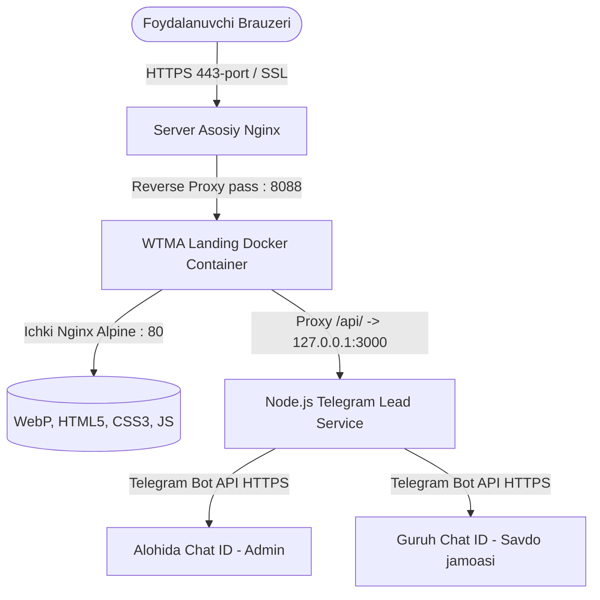

# WTMA — World Textile Marketing Agency

<div align="center">


### **Люди. Рынки. Возможности.**
*To'qimachilik va fashion sanoati uchun premium xalqaro marketing platformasi*

[](https://landing.okaposai.uz)
[](https://landing.okaposai.uz)
[](https://t.me)
[](https://developer.mozilla.org/en-US/docs/Web/HTML)
[](https://developer.mozilla.org/en-US/docs/Web/CSS)
[](https://developer.mozilla.org/en-US/docs/Web/JavaScript)
[](https://www.docker.com/)
[](https://nginx.org/)

</div>

---

## 📌 Mundarija
- [Loyiha Haqida](#-loyiha-haqida)
- [Jonli Demo](#-jonli-demo)
- [Sahifalar Arxitekturasi](#-sahifalar-arxitekturasi)
- [Asosiy Xususiyatlar va Interaktivlik](#-asosiy-xususiyatlar-va-interaktivlik)
- [Telegram Bot va Zayavkalar Tizimi (.env)](#-telegram-bot-va-zayavkalar-tizimi-env)
- [Dizayn Tizimi va Tipografiya](#-dizayn-tizimi-va-tipografiya)
- [Texnologiyalar Steki](#-texnologiyalar-steki)
- [Loyiha Tuzilishi](#-loyiha-tuzilishi)
- [Mahalliy Ishga Tushirish](#-mahalliy-ishga-tushirish)
- [Docker orqali Ishga Tushirish](#-docker-orqali-ishga-tushirish)
- [Serverga O'rnatish va Nginx Sozlamalari](#-serverga-ornatish-va-nginx-sozlamalari)
- [Tezlik va Kesh Siyosati (Performance)](#-tezlik-va-kesh-siyosati-performance)
- [Ijtimoiy Tarmoqlar va Bog'lanish](#-ijtimoiy-tarmoqlar-va-boglanish)

---

## 🏛 Loyiha Haqida

**WTMA (World Textile Marketing Agency)** — xalqaro to'qimachilik va moda (fashion) sanoati sub'ektlari (ishlab chiqaruvchilar, eksportchilar, investorlar va global brendlar) uchun xizmat ko'rsatuvchi yetakchi marketing agentligi.

Ushbu veb-platforma korxonalarga yangi bozorlarga chiqish, mahsulot brendini shakllantirish, xalqaro ko'rgazmalarda ishtirok etish va eksport hajmini oshirishda keng qamrovli raqamli hamroh bo'lib xizmat qiladi. Sayt yuqori darajadagi vizual estetika, moslashuvchan dark/light kontrastlar va mukammal mikro-animatsiyalar asosida qurilgan.

---

## 🌐 Jonli Demo

Platforma ishlab chiqarish (production) serverida to'liq ishga tushirilgan va SSL sertifikati bilan himoyalangan:
- **Asosiy manzil:** [https://landing.okaposai.uz](https://landing.okaposai.uz)
- **Instagram:** [@wtma.uz](https://www.instagram.com/wtma.uz?stkn=Y2V6NHJ2a3Jkbnph)

---

## 📑 Sahifalar Arxitekturasi

Platforma quyidagi to'liq va o'zaro bog'langan sahifalardan iborat:

| Sahifa | Fayl | Tavsif |
| :--- | :--- | :--- |
| **Bosh sahifa** | [`index.html`](index.html) | Asosiy landing sahifa: Hero, Agentlik haqida (01), Kompaniya tarixi (02), Missiya (03), Ish yondashuvi (04), Ekspertiza (05), Jamoa (06) va Aloqa modali. |
| **Faoliyat yo'nalishlari** | [`napravleniya.html`](napravleniya.html) | 5 ta strategik yo'nalish: Bozor tahlili, Marketing va brending, Ishlab chiqarish va mahsulot, Digital yechimlar va Biznes rivojlantirish. |
| **Loyihalar** | [`proyekty.html`](proyekty.html) | Haqiqiy keyslar va muvaffaqiyatli amalga oshirilgan B2B loyihalar (Tex Area, Molto Caldo, xalqaro ko'rgazmalar). |
| **Katalog** | [`katalog.html`](katalog.html) | To'qimachilik xomashyolari, gazlamalar va mahsulotlarning yuqori aniqlikdagi HD vizual katalogi. |
| **Media & Prodakshn** | [`media.html`](media.html) | Fabrikalar fotosessiyasi, video-kontent ishlab chiqarish, korporativ intervyular va sanoat media arxivi. |
| **Bog'lanish (Kontaktlar)** | [`contacts.html`](contacts.html) | Tashkent City biznes markazidagi manzil, interaktiv aloqa formasi va 3 ustunli qulay aloqa bloklari. |
| **3D Tekstil Namoyishi** | [`textile-3d.html`](textile-3d.html) | Interaktiv 3D tekstil ko'rgazmasi va vizual modellashtirish sahifasi. |

---

## ⚡ Asosiy Xususiyatlar va Interaktivlik

- 🧭 **Aqlli Moslashuvchan Header (Smart Adaptive Navigation)**:
  - Foydalanuvchi pastga aylantirganda (scroll down) silliq yashirinadi, yuqoriga aylantirganda (scroll up) darhol paydo bo'ladi.
  - Orqadagi bo'lim foniga (`dark-theme` yoki `light-theme`) qarab matn va logo ranglarini dinamik o'zgartiradi.
- 🎯 **ScrollSpy & Dinamik Indikator**:
  - Sahifaning qaysi bo'limida ekanligingizni aniqlaydi va menyudagi havolani qizil nuqta va ikki tomonlama chiziq animatsiyasi bilan ta'kidlaydi.
- 📈 **Animatsiyali Metrika Hisoblagichlari (Number Counters)**:
  - Hero qismida `10+ mamlakat`, `50+ loyiha` va `100+ hamkor` ko'rsatkichlari sahifaga kirilganda 0 dan boshlab dinamik hisoblanadi.
- ⏳ **Interaktiv Tarix Xronologiyasi (Timeline)**:
  - 2019-yildan 2025+ yilgacha bo'lgan rivojlanish bosqichlari qulay gorizontal xronologiya chizig'ida interaktiv aks etadi.
- ✉️ **Interaktiv Aloqa Modali (Lead Modal)**:
  - Bosh sahifa va media sahifasidan tezkor loyiha arizasi yuborish.
- 🌐 **Ko'p tilli interfeys tayyorgarligi**:
  - RU, EN, UZ tillarini tanlash menyusi va lokalizatsiya tayanch tizimi.
- 🖼 **Next-Gen WebP Grafika**:
  - Barcha og'ir rasmlar va vizuallar WebP formatiga o'tkazilib, `loading="lazy"` va `decoding="async"` atributlari bilan maksimal tezlikka erishilgan.

---

## 🤖 Telegram Bot va Zayavkalar Tizimi (.env)

Saytdagi barcha shakllar (Bosh sahifa modali, `contacts.html` sahifasi formasi va `media.html` modali) to'liq avtomatlashtirilgan bo'lib, foydalanuvchi ma'lumot qoldirgan paytda **zudlik bilan Telegram bot orqali bildirishnoma yuboradi**.

### 📬 Xabar Qayerga Yuboriladi?
Xabar bir vaqtning o'zida quyidagi **ikkala manzilga** yetkaziladi:
1. **Alohida Chat ID (Admin/Menejer shaxsiy chati):** Admin bot bilan shaxsiy chatida yangi arizani qabul qiladi (`TELEGRAM_CHAT_ID`).
2. **Guruh Chat ID (Kompaniya Telegram guruhi):** Zayavkalar butun savdo yoki marketing jamoasi ko'rib turishi uchun maxsus guruhga yuboriladi (`TELEGRAM_GROUP_ID`).

### 📱 Telegram Xabari Namunasi:
```text
🌟 YANGI ZAYAVKA — WTMA PLATFORMASI
━━━━━━━━━━━━━━━━━━━━━━━━━
👤 Mijoz: Alisher Zokirov
📞 Telefon: +998 90 123 45 67
✉️ Email: alisher@company.uz
🏢 Kompaniya: Silk Textile LLC
🎯 Yo'nalish: Bozor tahlili va eksport
💰 Byudjet: $10,000 - $30,000
📝 Xabar: Yangi bozorlarga eksport bo'yicha maslahat kerak.
━━━━━━━━━━━━━━━━━━━━━━━━━
🌐 Manba: Kontaktlar sahifasi
⏰ Vaqt: 30.09.2026, 15:47 (Toshkent vaqti)
```

---

### ⚙️ `.env` Faylini Sozlash

Loyiha ildiz papkasidagi `.env` faylida quyidagi parametrlarni o'z ma'lumotlaringiz bilan to'ldiring:

```env
# 1. Telegram Bot Token (@BotFather dan olinadi)
TELEGRAM_BOT_TOKEN=1234567890:ABCdefGHIjklMNOpqrsTUVwxyz

# 2. Botning shaxsiy chat ID-si (Alohida foydalanuvchi / Admin ID)
# (@userinfobot yoki @getmyid_bot orqali olinadi)
TELEGRAM_CHAT_ID=123456789

# 3. Telegram Guruh ID-si (Ochiq yoki YOPIQ guruh / kanal)
# Yopiq guruhlar uchun botni guruhga a'zo qilib, unga admin huquqini bering!
# Yopiq superguruh ID-si doim minus va 100 bilan boshlanadi: -100...
TELEGRAM_GROUP_ID=-1001234567890

# 3.1. Guruhdagi Topic / Mavzu ID-si (Ixtiyoriy)
# Agar yopiq guruhingizda Forum (Topics / Mavzular) yoqilgan bo'lsa:
TELEGRAM_GROUP_THREAD_ID=

# 4. Qo'shimcha chat ID lar (Ixtiyoriy, vergul bilan ajratilgan)
TELEGRAM_EXTRA_CHAT_IDS=

# 5. Ichki API Server Porti
PORT=3000
```

---

### 🔒 Yopiq Guruhlar (Private Groups) Bilan Ishlash:

Bot **istalgan yopiq guruhga (private group / channel)** bemalol xabar yuborishi uchun quyidagi 2 qoidaga rioya qilish kifoya:
1. **Botni yopiq guruhga a'zo qiling va unga Administrator (Admin) huquqini bering** (ayniqsa xabar yuborish ruxsati yoqilgan bo'lishi kerak).
2. **Yopiq guruh ID-sini to'g'ri kiriting:** Yopiq superguruhlar ID-si doim `-100` bilan boshlanadi (masalan `-1002489172314`).

#### 💡 Yopiq Guruh ID-sini Qanday Oson Topish Mumkin?
Hech qanday murakkab botlarsiz avtomatik aniqlash:
1. Botni yopiq guruhingizga a'zo qilib, admin qiling.
2. Guruh ichida birorta xabar (masalan: *"test"*) yozing.
3. Terminalda quyidagi buyruqni bering:
   ```bash
   node test-telegram.js --find
   ```
   *Skript bot ulangan barcha yopiq guruhlarni ko'rib, ularning ID-sini ekranga chiqarib beradi!*

---

### 🧪 Telegram Sozlamalarini Sinash (Test):

Bot to'g'ri sozlanganligini tekshirish va sinov xabari yuborish:
```bash
node test-telegram.js
```
*Ushbu skript ham shaxsiy chatga, ham yopiq guruhga test xabarini yuboradi va natijani terminalda rangli ko'rinishda ko'rsatadi.*


---

## 🎨 Dizayn Tizimi va Tipografiya

Loyihada jahonning yuqori darajadagi moda va arxitektura jurnallari estetikasidan ilhomlanilgan maxsus dizayn tizimi qo'llanilgan:

### Shriftlar (Typography)
- **Cormorant Garamond**: Hashamatli, nafis sarlavhalar va iqtiboslar uchun klassik editorial serif.
- **Plus Jakarta Sans**: Aniq, qulay o'qiluvchi va zamonaviy matnlar uchun geometrik sans-serif.

### Ranglar Palitrasi (Color Palette)
```css
/* Asosiy ranglar */
--color-bg-dark:       #0A0D14; /* Deep Obsidian */
--color-bg-card:       #111827; /* Rich Dark Charcoal */
--color-accent-gold:   #C5A880; /* Warm Champagne Gold */
--color-accent-red:    #E53935; /* Signature Crimson Accent */
--color-text-light:    #F8F9FA; /* Crisp Off-White */
--color-text-muted:    #94A3B8; /* Slate Gray */
--color-bg-light:      #F5F5F7; /* Apple Luxury Light Neutral */
```

---

## 🛠 Texnologiyalar Steki

| Qatlam | Texnologiya | Izoh |
| :--- | :--- | :--- |
| **Frontend Asosi** | HTML5 (Semantik) | W3C standartlariga mos, to'liq SEO va qulaylik (a11y) me'yorlari bilan |
| **Uslublar (Styling)** | Vanilla CSS3 (Custom Design System) | Flexbox, CSS Grid, CSS Variables, Glassmorphism, Micro-animations |
| **Interaktivlik** | Vanilla JavaScript (ES6+) | Kutubxonalarsiz, engil va chaqqon toza JS (ScrollSpy, Counter, Modal, Timeline) |
| **Zayavkalar API** | Node.js (Microservice) / Python 3 | `POST /api/send-lead` — Telegram Bot API integratsiyasi (zero external deps) |
| **Xabardor qilish** | Telegram Bot API | Shaxsiy chat (`TELEGRAM_CHAT_ID`) va Guruh (`TELEGRAM_GROUP_ID`) ga xabarlar |
| **Konteynerizatsiya** | Docker & Docker Compose | Nginx + Node.js integratsiyalangan avtonom ishlab chiqarish muhiti |
| **Veb Server** | Nginx Alpine | Gzip siqish, 30 kunlik media-kesh, no-cache HTML qoidalari va Security Headers |
| **Reverse Proxy** | Server Nginx + Certbot | Let's Encrypt SSL orqali HTTPS himoyasi va port yo'naltirish |

---

## 📂 Loyiha Tuzilishi

```text
wtma_landingPage/
├── index.html                   # Asosiy landing sahifasi
├── napravleniya.html            # Faoliyat yo'nalishlari sahifasi
├── proyekty.html                # Amalga oshirilgan loyihalar sahifasi
├── katalog.html                 # Mahsulot va gazlamalar katalogi
├── media.html                   # Media va video prodakshn sahifasi
├── contacts.html                # Tashkilot bilan bog'lanish sahifasi
├── textile-3d.html              # 3D tekstil ko'rgazmasi
│
├── server.js                    # Telegram Bot & Lead qabul qiluvchi API microservice (Node.js)
├── server.py                    # Alternativ Python microservice
├── test-telegram.js             # Telegram bot va chat ID larni tekshiruvchi test skripti
├── docker-entrypoint.sh         # Docker ichida Node.js va Nginx ni birga ko'taruvchi skript
│
├── .env.example                 # Telegram sozlamalari namunasi
├── .env                         # Maxfiy sozlamalar fayli (Bot Token, Chat ID, Group ID)
├── .gitignore                   # Git xavfsizlik qoidalari (.env himoyalangan)
│
├── css/                         # Modulli CSS uslublari
│   ├── style.css                # Asosiy global dizayn tizimi va o'zgaruvchilar
│   ├── napravleniya.css         # Yo'nalishlar sahifasi uslubi
│   ├── projects.css             # Loyihalar sahifasi uslubi
│   ├── katalog.css              # Katalog sahifasi uslubi
│   ├── media.css                # Media sahifasi uslubi
│   └── contacts.css             # Kontaktlar va xarita uslubi
│
├── js/                          # Interaktiv skriptlar
│   ├── main.js                  # Bosh sahifa logikasi (Header, ScrollSpy, Counter, Modal, Telegram API)
│   ├── napravleniya.js          # Yo'nalishlar sahifasi dinamikasi
│   ├── projects.js              # Loyihalar filtri va kartochkalari
│   ├── katalog.js               # Katalog qidiruv va kategoriyalar
│   ├── media.js                 # Media galereya va video boshqaruvi
│   └── contacts.js              # Kontakt formasi validatsiyasi va Telegram API
│
├── images/                      # Jamoa va boshqa optimallashtirilgan rasmlar
├── 6_block_ekspertiza/          # Ekspertiza bo'limi uchun yuqori sifatli WebP rasmlar
│
├── Dockerfile                   # Nginx Alpine + Node.js bazasidagi Dockerfile
├── docker-compose.yml           # Docker Compose orqali konteyner boshqaruvi (.env ulangan)
├── nginx.conf                   # Konteyner ichidagi Nginx va /api/ proxy sozlamalari
├── server_nginx/                # Serverdagi asosiy Nginx uchun konfiguratsiya
│   └── landing.okaposai.uz.conf # Reverse proxy konfiguratsiya namunasi
│
├── DEPLOY.md                    # Serverga deploy qilish bo'yicha bosqichma-bosqich qo'llanma
└── README.md                    # Loyiha hujjatlari
```

---

## 💻 Mahalliy Ishga Tushirish

Loyihani o'z kompyuteringizda sinab ko'rish uchun quyidagi usullardan birini tanlang:

### 1-usul: Node.js orqali (Tavsiya etiladi — Sayt + Telegram API)
```bash
# 1. Loyiha papkasiga kiring
cd wtma_landingPage

# 2. .env fayliga bot token va ID laringizni kiriting
# (.env.example faylidan nusxa olib yaratiladi)

# 3. Serverni ishga tushiring
node server.js
```
Brauzerda oching: `http://localhost:3000`  
*(Saytdagi formalar avtomatik ravishda Telegram botingizga zayavka yuboradi)*

### 2-usul: Python orqali
```bash
python server.py
```
Brauzerda oching: `http://localhost:3000`

### 3-usul: Oddiy brauzerda ochish
[`index.html`](index.html) faylini istalgan brauzerda ikki marta bosib ochishingiz mumkin.

---

## 🐳 Docker orqali Ishga Tushirish

Konteyner orqali ishga tushirish — ishlab chiqarish muhitini o'z kompyuteringizda yoki serverda to'liq qaytaradi:

1. **Docker konteynerini yaratish va orqa fonda ishga tushirish:**
   ```bash
   docker compose up -d --build
   ```

2. **Ishlayotgan konteyner holatini tekshirish:**
   ```bash
   docker ps
   ```

3. **Saytni brauzerda ochish:**
   - Konteyner porti: `http://localhost:8082` (yoki `docker-compose.yml` da belgilangan port)

4. **Konteynerni to'xtatish:**
   ```bash
   docker compose down
   ```

---

## 🚀 Serverga O'rnatish va Nginx Sozlamalari

### Arxitektura Sxemasi



### Tezkor O'rnatish Bosqichlari:

1. **DNS sozlamalari**: Domeningizda `landing.okaposai.uz` A yozuvini server IP manziliga yo'naltiring.
2. **Loyihani serverga klonlash**:
   ```bash
   cd /var/www
   git clone https://github.com/SunnatDevPy/wtma_landingpage.git landing_wtma
   cd landing_wtma
   ```
3. **Telegram `.env` sozlamalarini kiritish**:
   ```bash
   nano .env
   # TELEGRAM_BOT_TOKEN, TELEGRAM_CHAT_ID va TELEGRAM_GROUP_ID ni yozing
   node test-telegram.js
   ```
4. **Docker konteynerini ishga tushirish**:
   ```bash
   docker compose up -d --build
   ```
5. **Nginx Reverse Proxy sozlash**:
   [`server_nginx/landing.okaposai.uz.conf`](server_nginx/landing.okaposai.uz.conf) faylini `/etc/nginx/sites-available/` ga ko'chiring va faollashtiring:
   ```bash
   sudo ln -s /etc/nginx/sites-available/landing.okaposai.uz.conf /etc/nginx/sites-enabled/
   sudo nginx -t
   sudo systemctl reload nginx
   ```
6. **Bepul SSL (Let's Encrypt) yoqish**:
   ```bash
   sudo certbot --nginx -d landing.okaposai.uz
   ```

> 📖 *Batafsil ma'lumot va tushuntirishlar uchun maxsus qo'llanmaga qarang:* **[DEPLOY.md](DEPLOY.md)**

---

## ⚡ Tezlik va Kesh Siyosati (Performance)

Nginx konfiguratsiyasida saytning chaqqon ishlashi va o'zgarishlar tez aks etishi uchun qat'iy qoidalar belgilangan:

- **HTML keshsizligi (`no-cache`)**:
  Yangi matnlar, loyihalar yoki rasm yangilanishlari barcha tashrif buyuruvchilarda zudlik bilan aks etishi uchun `.html` sahifalar brauzer xotirasiga keshlanmaydi.
- **Statik resurslar keshi (30 kun)**:
  Barcha `.webp`, `.png`, `.jpg`, `.css` va `.js` fayllari brauzerda 30 kun saqlanadi, bu esa takroriy tashriflarda sahifaning lahzali ochilishini ta'minlaydi.
- **Gzip siqish**:
  Barcha matnli resurslar (HTML, CSS, JS, SVG, JSON) tarmoq orqali yuborilishdan oldin siqilib, internet trafigi 70% gacha tejaladi.
- **Xavfsizlik sarlavhalari (Security Headers)**:
  `X-Frame-Options`, `X-Content-Type-Options` va `X-XSS-Protection` boshliqlari kiberxavfsizlikni kuchaytiradi.

---

## 📞 Ijtimoiy Tarmoqlar va Bog'lanish

- 🏢 **Kompaniya:** WTMA (World Textile Marketing Agency)
- 📍 **Manzil:** O'zbekiston, Toshkent sh., Tashkent City Biznes Markazi
- 🌐 **Veb-sayt:** [landing.okaposai.uz](https://landing.okaposai.uz)
- 📷 **Instagram:** [@wtma.uz](https://www.instagram.com/wtma.uz?stkn=Y2V6NHJ2a3Jkbnph)
- 💼 **LinkedIn:** [WTMA Global](https://linkedin.com)
- ✈️ **Telegram:** [@wtma_official](https://t.me)

---

<div align="center">

© 2026 **WTMA (World Textile Marketing Agency)**. Barcha huquqlar himoyalangan.  
*Текстиль сегодня. Больше возможностей завтра.*

</div>
